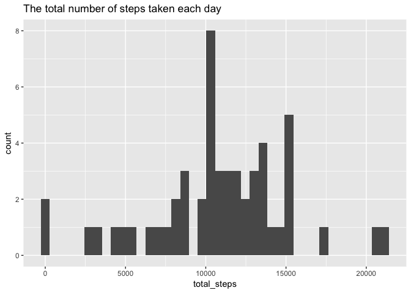
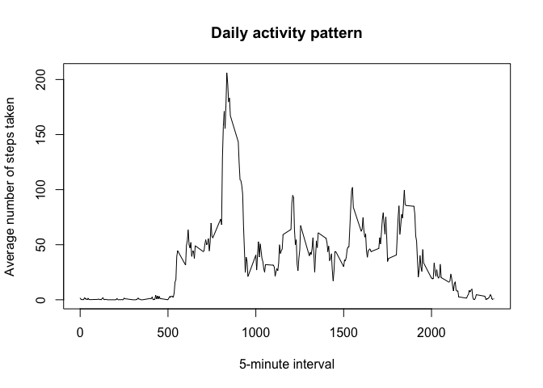
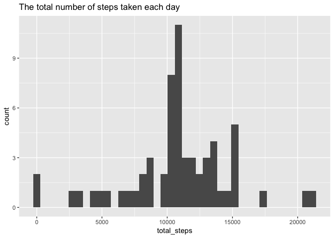
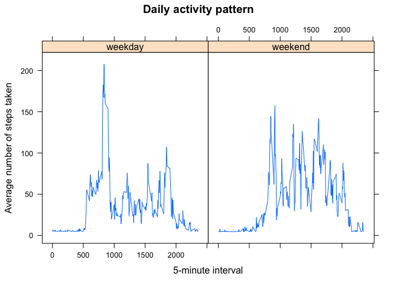

# Reproducible Research: Peer Assessment 1

## Loading and preprocessing the data

Load the data into R

```r
library(dplyr)
```

```
## 
## Attaching package: 'dplyr'
```

```
## The following objects are masked from 'package:stats':
## 
##     filter, lag
```

```
## The following objects are masked from 'package:base':
## 
##     intersect, setdiff, setequal, union
```

```r
library(lubridate)
```

```
## 
## Attaching package: 'lubridate'
```

```
## The following object is masked from 'package:base':
## 
##     date
```

```r
data <- read.csv("activity.csv", header = TRUE, stringsAsFactors = FALSE)
str(data)
```

```
## 'data.frame':	17568 obs. of  3 variables:
##  $ steps   : int  NA NA NA NA NA NA NA NA NA NA ...
##  $ date    : chr  "2012-10-01" "2012-10-01" "2012-10-01" "2012-10-01" ...
##  $ interval: int  0 5 10 15 20 25 30 35 40 45 ...
```

```r
dataset <- tbl_df(data)

## convert date
dataset <- dataset %>% mutate(date=ymd(date))
summary(dataset)
```

```
##      steps             date               interval     
##  Min.   :  0.00   Min.   :2012-10-01   Min.   :   0.0  
##  1st Qu.:  0.00   1st Qu.:2012-10-16   1st Qu.: 588.8  
##  Median :  0.00   Median :2012-10-31   Median :1177.5  
##  Mean   : 37.38   Mean   :2012-10-31   Mean   :1177.5  
##  3rd Qu.: 12.00   3rd Qu.:2012-11-15   3rd Qu.:1766.2  
##  Max.   :806.00   Max.   :2012-11-30   Max.   :2355.0  
##  NA's   :2304
```

## What is mean total number of steps taken per day?


```r
per_day <-  dataset %>% na.omit %>% group_by(date)

summary <- per_day %>% summarise(sum(steps))
names(summary) <- c("day", "total_steps") 

print(summary) 
```

```
## # A tibble: 53 x 2
##           day total_steps
##        <date>       <int>
##  1 2012-10-02         126
##  2 2012-10-03       11352
##  3 2012-10-04       12116
##  4 2012-10-05       13294
##  5 2012-10-06       15420
##  6 2012-10-07       11015
##  7 2012-10-09       12811
##  8 2012-10-10        9900
##  9 2012-10-11       10304
## 10 2012-10-12       17382
## # ... with 43 more rows
```


```r
library(ggplot2)

qplot(total_steps, data = summary, geom = "histogram", bins = 40, 
      main = "The total number of steps taken each day")
```

<!-- -->

```r
mean_total_steps <- mean(summary$total_steps)
print(mean_total_steps)
```

```
## [1] 10766.19
```

```r
median_total_steps <- median(summary$total_steps)
print(median_total_steps)
```

```
## [1] 10765
```

Mean total number of steps taken per day: **10766**
Median total number of steps taken per day: **10765**

## What is the average daily activity pattern?


```r
per_interval <- dataset %>% na.omit %>% group_by(interval)

summary2 <- per_interval %>% summarise(mean(steps))
names(summary2) <- c("interval", "mean_steps") 
str(summary2)
```

```
## Classes 'tbl_df', 'tbl' and 'data.frame':	288 obs. of  2 variables:
##  $ interval  : int  0 5 10 15 20 25 30 35 40 45 ...
##  $ mean_steps: num  1.717 0.3396 0.1321 0.1509 0.0755 ...
##  - attr(*, "na.action")=Class 'omit'  Named int [1:2304] 1 2 3 4 5 6 7 8 9 10 ...
##   .. ..- attr(*, "names")= chr [1:2304] "1" "2" "3" "4" ...
```

```r
plot(summary2$interval, summary2$mean_steps, type = "l" ,
     xlab="5-minute interval", ylab="Average number of steps taken",
     main="Daily activity pattern")
```

<!-- -->

```r
## Which 5-minute interval, on average across all the days in the dataset, contains the maximum number of steps?
print( summary2 %>% filter(mean_steps == max(mean_steps)) )
```

```
## # A tibble: 1 x 2
##   interval mean_steps
##      <int>      <dbl>
## 1      835   206.1698
```


## Imputing missing values

Number of missing values in *steps* column: 2304  
Number of missing values in *date* column: 0  
Number of missing values in *interval* column: 0  


```r
## average number of steps taken every day
mean_total_steps <- mean(summary$total_steps)
print(mean_total_steps)
```

```
## [1] 10766.19
```

**Let's replace missing values in *steps* column with an average number of steps taken every day divided by the number of time periods.**


```r
repl <- as.integer(mean_total_steps / length(unique(dataset$interval)))
fixed_dataset <- mutate(dataset, steps = ifelse(is.na(steps), repl,  steps))
str(fixed_dataset)
```

```
## Classes 'tbl_df', 'tbl' and 'data.frame':	17568 obs. of  3 variables:
##  $ steps   : int  37 37 37 37 37 37 37 37 37 37 ...
##  $ date    : Date, format: "2012-10-01" "2012-10-01" ...
##  $ interval: int  0 5 10 15 20 25 30 35 40 45 ...
```

Number of missing values in *steps* column: 0  


```r
per_day <- fixed_dataset %>% group_by(date)

summary3 <- per_day %>% summarise(sum(steps))
names(summary3) <- c("day", "total_steps") 

print(table(summary3$total_steps))
```

```
## 
##    41   126  2492  3219  4472  5018  5441  6778  7047  7336  8334  8355 
##     1     1     1     1     1     1     1     1     1     1     1     1 
##  8821  8841  8918  9819  9900 10056 10119 10139 10183 10304 10395 10439 
##     1     1     1     1     1     1     1     1     1     1     1     1 
## 10571 10600 10656 10765 11015 11162 11352 11458 11829 11834 12116 12426 
##     1     1     8     1     1     1     1     1     1     1     1     1 
## 12608 12787 12811 12883 13294 13452 13460 13646 14339 14478 15084 15098 
##     1     1     1     1     1     1     1     1     1     1     1     1 
## 15110 15414 15420 17382 20427 21194 
##     1     1     1     1     1     1
```

```r
qplot(total_steps, data = summary3, geom = "histogram", bins = 40,
      main = "The total number of steps taken each day")
```

<!-- -->

```r
## Calculate and report the mean and median total number of steps taken per day. Do these values differ from the
## estimates from the first part of the assignment?

mean_total_steps <- mean(summary3$total_steps)
print(mean_total_steps)
```

```
## [1] 10751.74
```

```r
median_total_steps <- median(summary3$total_steps)
print(median_total_steps)
```

```
## [1] 10656
```

The mean and median total number of steps taken per day don't significantly differ from the estimates from the first part of the assignment.

Imputing missing data doesn't have any significant impact on the estimates of the total daily number of steps.


## Are there differences in activity patterns between weekdays and weekends?


```r
fixed_dataset <- fixed_dataset %>% mutate(day_type = ifelse(wday(date) == 1 | wday(date) == 7, "weekend", "weekday"))
str(fixed_dataset)
```

```
## Classes 'tbl_df', 'tbl' and 'data.frame':	17568 obs. of  4 variables:
##  $ steps   : int  37 37 37 37 37 37 37 37 37 37 ...
##  $ date    : Date, format: "2012-10-01" "2012-10-01" ...
##  $ interval: int  0 5 10 15 20 25 30 35 40 45 ...
##  $ day_type: chr  "weekday" "weekday" "weekday" "weekday" ...
```

```r
per_interval <- fixed_dataset %>% group_by(interval, day_type)

summary4 <- per_interval %>% summarise(mean(steps))
names(summary4) <- c("interval", "day_type", "mean_steps") 
str(summary4)
```

```
## Classes 'grouped_df', 'tbl_df', 'tbl' and 'data.frame':	576 obs. of  3 variables:
##  $ interval  : int  0 0 5 5 10 10 15 15 20 20 ...
##  $ day_type  : chr  "weekday" "weekend" "weekday" "weekend" ...
##  $ mean_steps: num  6.96 4.62 5.33 4.62 5.09 ...
##  - attr(*, "vars")= chr "interval"
##  - attr(*, "drop")= logi TRUE
```

```r
library(lattice)

xyplot(mean_steps ~ interval | day_type, type = "l" ,
     xlab="5-minute interval", ylab="Average number of steps taken",
     main="Daily activity pattern", data=summary4)
```

<!-- -->

